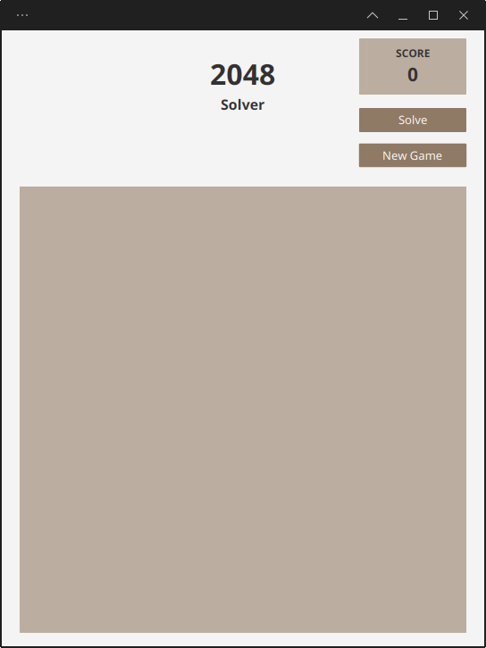
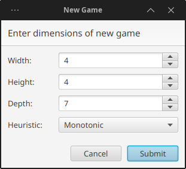
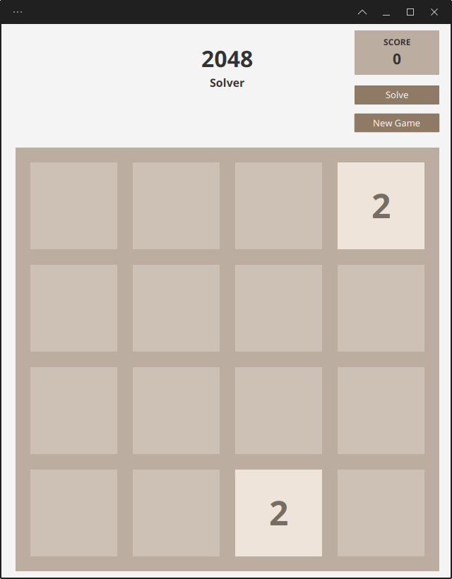

# Final Year Project: 2048 Solver

## Requiremen
- Java 17 +
- Maven (Building Only)


## Packaging
This can be built into a jar file with all dependices (except java and maven) bundeld with the commands
```sh
cd program
mvn package
```

A jar file will be produced in `program/target/Solve2048-1.0.0-jar-with-dependencies.jar`

## Usage
### Running
To start the program with a graphical mode there are two options on how to run the program.
```sh
cd program
mvn package
cd target
java -jar Solve2048-1.0.0-jar-with-dependecies.jar
```

```sh
cd program
mvn javafx:run
```
However there are many diffrent ways the program can be run, using various commandline arguments:


* -b/--benchmark *count*: run the program in benchmark mode, runing each configuration *count* times. Most specifcy output using -o/--output.
* -s/--optimise *count* *iteration*: run the program in optimise view. Run each iteration *count* times and run *iteration* count. Must specify output using -o/--output
* -o/--output *csv*: specify the file to output data to for benchmark and optimise views.
* -e/--seed *seed*: specify the file seed of the game to play, using seeded game view.
* -t/--tree-log *dir*: log trees from 2048 game to diretory *dir*.
* -d *rows* *cols* *val<sub>1</sub>* ... *val*<sub>n</sub> *timeout*. Generate a tree from a game state of size *rows* x *cols* with values *value*<sub>1</sub> ... *value*<sub>n</sub>. Outputs depth of tree generated in *timeout* ms.
### Graphical View

To open in graphical, simply run the jar file, by double clicking or running the comand `java -jar {path/to/jar}`

When openned you will se a window like this:

{width=300px}

To create a new game click the 'New Game' button, a popup window will appear.

{width=300px}

Enter the width and height of the game. Beware, with large games or depths , it is very easy to crash the program.

You can select the heustic from a pre set list of options, if you want to use more advananced featuers, like pruning, dynamic depth or more spefcifc heuristics it is advlisable to use the seeded game view.

Once you have filled in the dialouge and clicked submit, a game will be drawn onto the game view.

{width=300px}

Click the solve button and the game will begin playiing itself.

### Benchmark View
Enter the dir `program/src/main/java/uk/ac/rhul/project/benchmark/BenchmarkView.java` to change what heurstics are being benchmarked.
On line 29 there is an array that looks somthing like
```java
    private static final GameConfiguration[] CONFIGURATIONS = new GameConfiguration[]{
       new GameConfiguration(4, 4, 7, Integer.MAX_VALUE, new FailSetter(new Monotonic(), -1000)),
       new GameConfiguration(4, 4, 7, 3, new FailSetter(new Monotonic(), -1000)),
       new GameConfiguration(4, 4, 7, 2, new FailSetter(new Monotonic(), -1000)),

    };
```

This config means run a 4x4 game, depth 7, No Pruning using Monotnic Herustic with a fail setter,
             
then run a 4x4 game, depth 7, Prune on 3 '4's using Montonic Herustic with a fail setter.
            
then run a 4x4 game, depth 7, Prune on 2 '4's using Montonic Herustic with a fail setter.

To run this configration run the commands
```sh
cd program
mvn pacakge
cd target
java -jar {path/to/jar} -b {number of time to run each game} -o {path/to/csv/file}
```

**Note:** that each game in the benchmark view is run, the games are seeded. Every time a configuration is run a certian number of times, the data will be identical.
l
The csv output will like this:

```csv
heuristicName,maxTile,score,time
4 x 4 game using Monotonic(With Fail),8192,175868,5179196
4 x 4 game using Monotonic(With Fail),16384,269512,7640634
4 x 4 game using Monotonic(With Fail),8192,174948,5050310
4 x 4 game using Monotonic(With Fail),8192,134144,4432112
4 x 4 game using Monotonic(With Fail),8192,134092,4552420
4 x 4 game using Monotonic(With Fail),8192,125544,4444804
4 x 4 game using Monotonic(With Fail),4096,74824,2896079
4 x 4 game using Monotonic(With Fail),8192,134664,4428082
4 x 4 game using Monotonic(With Fail),8192,157704,4917691
```
The four columns are, breif desciption of the Config, the max tile achived, the score acheived, amount of time taken to complete the game.

### Optimiser View

The optimiser view, like the benchmark view has some configuration options only accesiable via modifying the code.
These can be changed by opening `program/src/main/java/uk/ac/rhul/project/benchmark/OptimiserView.java`. The options
in this file are:

* `minN = ...;` (line:25) The minum value to try parsing into `makeGame` (Inclusive)
* `maxN = ...;` (line:30) The maxumum value to try parsing into `makeGame` (Inclusive)
* `makeGame(n) {...}` (line:107) The function being optimised. This should return a gameConfigruation that uses the value n.

While running a table will be dipslayed giving a hint of how its prefoming. Please note, that while this table can be used to hint at what value is the best,
the measurements are not optimised for the data, and are not accurate for all data sets.

To run the optimiser view run theses commands:
```sh
cd program
mvn pacakge
cd target
java -jar {path/to/jar} -s {count} {iterations} -o {path/to/csv}
```
count is the number of times a game is run with each value of n

iterations is the number of values of n to take. For example if n is set to range from 0 to 1 and iterations is 3, n will take the values: 0, 0.5 and 1.

The csv file output will be similar to that of the benchmark.
```csv
heuristicName,maxTile,score,time
n=-1.0,4096,60628,160662
n=-1.0,4096,79560,160662
n=-0.8,4096,74748,160662
n=-0.8,4096,67552,160662
n=-0.6000000000000001,2048,36116,160662
n=-0.6000000000000001,2048,38252
n=-0.4000000000000001,4096,59876,160662
n=-0.4000000000000001,4096,80536,160662
n=-0.20000000000000007,2048,38680,160662
n=-0.20000000000000007,4096,62296,160662
n=-5.551115123125783E-17,2048,36076,160662
n=-5.551115123125783E-17,8192,130112,160662
n=0.19999999999999996,4096,58500,160662
n=0.19999999999999996,2048,36232,160662
n=0.39999999999999997,4096,61356,160662
n=0.39999999999999997,2048,36340,160662
n=0.6,4096,71460,160662
n=0.6,8192,124100,160662
n=0.8,4096,80152,160662
n=0.8,4096,77256,160662
n=1.0,2048,31480,160662
n=1.0,2048,33980,160662
```
(note that the time column is faked, I have no data saved from this since adding the time column)

Depsite the first column being labeled heursticName, it is the value of n.

## Seeded Game View.
If you want to play a game with a specif seed, you should use the seeded game view. The seeded game view has can play any game of a specfic size. Like the other commandline interfaces, some configuration has to done from within the code. 

This time the file is `program/src/main/java/uk/ac/rhul/project/benchmark/SeededGameView.java`. The game configuration is set on line 40.
```java
this.gameConfiguration =
        new GameConfiguration(4, 4, BenchmarkerView::depth4_4,
         Integer.MAX_VALUE, new FailSetter(new Monotonic(), -1000));
```
This confonfig means make a 4x4 game, using a dynamic depth, no pruning and the Montonic heursiti with a fail setter.

To run the seeded game view the commands are:
To run the optimiser view run theses commands:
```sh
cd program
mvn pacakge
cd target
java -jar {path/to/jar} -e {seed}
```

You can also use the -t argument, which logs the trees to a provided directory. Be aware that these trees can quickly get very large and and great increase the time taken to complete a game.

For example prosecing the depth 7 game with monotonic (and a fail setter), width seed 0, takes me just under 20 mineuts, the same game with tree logging enabled takes over 1 hour, and produces over 80GiB of files.


